# **足球机器人模拟控制算法**

# 摘要

机器人足球赛是检验各种强化学习算法的重要途径。本文搭建了新的足球机器人赛模拟平台，具有环境自由度高，实验环境要求低、适用性广的特点。并在此基础上，研究了足球机器人控制的两种算法。

第一是使用**DDPG**算法进行深度强化学习，控制足球机器人。首先，梳理了强化学习的基本概念和q-learning算法的基本思想，根据**马尔可夫决策过程**的基本假设，对足球机器人建立智能体模型。然后，在文献调研和问题分析的基础上，决定采用DDPG这一强化学习算法来控制足球机器人。最后，在回报函数中加入**dicR****项**以优化DDPG算法，采用两次训练法训练DDPG算法，预训练模型用于后续实验。

第二是使用**符号智能算法**进行足球机器人控制，并与深度强化学习机器人进行1v1足球赛。用足球比赛的经验和规则建立知识库，通过知识库进行逻辑推演，得到控制足球机器人的算法流程。符号智能机器人被作为训练DDPG算法的对手机器人，前期符号智能机器人**优于**DDPG机器人，但是随着训练时间的增多，DDPG机器人开始**反超**符号智能机器人。

使用遗传算法对DDPG算法的超参数进行优化。将DDPG算法的超参数向量作为种群的个体，使用**GA**算法进行种群的迭代，在种群适应度收敛后，得出DDPG算法的最优**超参数**。

将1v1扩展至3v3，基于**PSO**算法进行群体控制。将每一个足球运动员作为粒子群中的一枚粒子，利用群体的信息，实现了协作中知识方面的有意识合作行为。根据学习因子的不同，有两种策略，集中型策略和分散型策略，最终实验表明高学习因子的**集中型策略**表现更优。

**关键词：DDPG**  **符号智能  GA  PSO** **集中型策略**

[TOC]

# 问题背景

最初的机器人足球理念于1992年由加拿大不列颠哥伦比亚大学的Alan Mackworth 教授正式提出[1] 。1997 年，第 15 届国际人工智能联合大会宣布将机器人足球正式列为人工智能研究和学习的一个领域，并规定了每年举办一次国际型赛事。机器人足球是检验各种强化学习算法的重要方式。

我们探讨在足球机器人仿真平台上如何使用强化学习来控制足球机器人，在这一方面已有许多研究。另外，符号智能是更具解释性的，计算效率更高的智能方式，所以我们探讨符号智能在强化学习方面的应用。在此之后，我们通过1v1足球赛，找出上述二者中更优的模型，我们以进化计算的方式对其进行优化。最后，运用群智能算法将目标从1v1的单人动作决策扩展到3v3的分布式问题求解当中。

# 智能体模型

智能体是驻留于环境中的实体，它可以解释从环境中获得的反应环境中所发生事件的数据，并执行对环境产生影响的行动。智能体通过自身的感知来探索外部环境并改变自身内部的状态以达到某种目的。为足球仿真机器人建立智能体模型，我们需要先清楚足球比赛的基本规则以使得所建立的模型能够以类人的决策方式进行比赛。由于足球比赛的胜负判定以进球为标准，因此我们将进球与阻止对方进球作为决策智能体行动的两个首要目标，以此为基础，通过深度强化学习和符号智能两种不同的方式对于单一智能体的行动模式进行控制。

## 智能体模型假设

### 1. 感知
智能体能够感知以下信息：
- 自身位置：$(x_1, y_1)$
- 对方球员位置：$(x_2, y_2)$
- 球的位置：$(b_x, b_y)$
- 己方球门位置：$(g_{1x}, g_{1y})$
- 对方球门位置：$(g_{2x}, g_{2y})$

---

### 2. 运动
- **运动方向**：简化为四个方向：上（`u`）、下（`d`）、左（`l`）、右（`r`）
- **运动方式**：按回合进行，每回合选择一个方向（通过某种算法计算得到）

#### 运动距离定义：
欧氏距离公式为：
$$
d = \sqrt{(x_i - b_x)^2 + (y_i - b_y)^2}
$$

#### 运动模式：
- 当 $ d > ATD $：进入**运动模式**，每回合移动距离为 $ dx $
- 当 $ d \leq ATD $：进入**攻击模式**，每回合移动距离为 $ 2dx $

---

### 3. 踢球

#### 触发条件：
当智能体与球的距离满足 $ d < KID $ 时，触发踢球动作。

#### 踢球角度公式：
踢球角度 $\theta$ 满足：
$$
\theta = k_1 \theta_1 + k_2 \theta_2 + N
$$
其中：
- $k_1 + k_2 = 1$，$k_1, k_2$ 为人为设定的超参数
- $N$ 为高斯分布噪声，$N \sim \mathcal{N}(\mu, \sigma^2)$

##### 各部分定义：

1. **惯性部分**（$\theta_1$）：
   表示球员与球碰撞的角度，定义为：
   $$
   \tan \theta_1 = \frac{y_i - b_y}{x_i - b_x}
   $$

2. **目标部分**（$\theta_2$）：
   表示球与球门连线的角度，定义为：
   $$
   \tan \theta_2 = \frac{g_{iy} - b_y}{g_{ix} - b_x}
   $$

## 足球环境说明

本文采用 Python 的 `turtle` 绘图库来进行运行环境的搭建，实现了一个简洁且成功的强化学习环境。

该环境分为四个部分：
- 场地绘制
- 部件绘制
- 机器人移动
- 机器人踢球

环境优点

- **环境自由度高**：每一个部件都由手写 Python 代码绘制，方便环境的修改。
- **环境要求低**：如果仅仅使用符号智能机器人，只需安装 `turtle` 库即可运行，无需安装复杂的环境。
- **适用性广**：上交的代码将自己作出的模型假设嵌入其中，如果其他研究需要重新作出其他假设，则可以方便地修改环境代码。

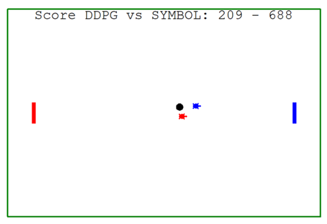

# 强化学习模型

强化学习是智能体在自然环境的交互过程中，通过反复试错来学习最优的行为。强化学习中，智能体与环境不断进行交互，从中获得环境信息，之后采取一定动作作用于环境，并从环境中获得一个反馈的评价信号，根据此信号进行不断的试错和选择，逐渐学习得到最优策略。强化学习过程中，智能体根据获得的不同的环境信息来选择动作，作用于环境之后，环境会给出一个奖赏值，即智能体的回报值。强化学习的目标就是使智能体获得的回报值最大，从而得到最优策略。

强化学习的主体有智能体(agent)和环境(environment)，可以建模为：一个智能体(agent)怎么在一个复杂不确定的环境(environment)里面去极大化它能获得的奖励。通过感知所处环境的状态(state)对动作(action)的反应(reward)，来指导更好的动作，从而获得最大的收益(return)。

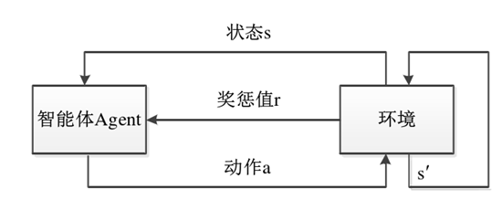

## 马尔可夫决策过程

可以用马尔可夫决策过程（Markov Decision Processes, MDP）来形式化地描述强化学习问题。马尔可夫性是指一个随机过程将来发展的概率规律与之前的历史无关的性质。马尔可夫过程就是状态转移具有马尔可夫性的随机过程。

### 强化学习过程

- 一个智能体在$t$时刻感知到环境状态$s_t$。
- 智能体采用其策略函数$\pi(s, a)$选择一个动作$a_t$并执行。
- 环境依据转移函数$T(s, a, s')$根据智能体的动作发生状态转移至$s_{t+1}$。
- 同时，环境根据回报函数$R(s)$反馈给智能体一个回报。

强化学习问题具有状态转移与历史无关的性质，即马尔可夫性，所以可以用马尔可夫决策过程来描述强化学习问题。在马尔可夫决策过程中，所使用的函数——策略函数$\pi(s, a)$、转移函数$T(s, a, s')$、回报函数$R(s)$——只取决于当前的环境状态和动作行为，与先前的环境状态和所采取的动作均没有关系。

### 马尔可夫决策过程表示

可以用四元组$(S, A, T, R, \pi)$来表示一个马尔可夫决策过程：

- $S$是状态空间集合。
- $A$是动作集合。
- $T$是环境的状态转移，定义为$T: S \times A \to P(S|S, A)$，代表了从状态空间$S$和动作空间$A$的笛卡尔积到状态$S$的概率分布$P$的映射。
- $R$是智能体作用于环境后的回报，定义为$R: S \times A \times S \to \mathbb{R}$，是从状态空间$S$和动作空间$A$的笛卡尔积到回报$\mathbb{R}$的映射。
- $\pi$表示策略$\pi: S \to A$，是智能体根据状态$S$选择动作$A$遵循的策略。


## 回报函数和值函数

在每次转移到新的状态或做出新的动作后，智能体一般会获得奖励，而为了使算法更快收敛，同时保证智能体在有限的检索中尽可能做出在当前看来有利的举动，加入折扣因子 $\gamma$ 的概念，即每个奖励会随着所需要时间的延长而衰减，回报即奖励的求和。即为累计折扣回报：

$$
R_t = \sum_{k=0}^{\infty} \gamma^k r_{t+k+1}
$$

值函数分为状态值函数（V值函数）和状态动作值函数（Q值函数）。

V值函数是一个从学习的状态空间 $S$ 到实数集 $\mathbb{R}$ 的映射。给定一个策略 $\pi$ 后，每一个状态 $s$ 都会有一个值函数 $V^\pi(s)$，该值表示智能体在策略 $\pi$ 的指导下，从某一状态 $s$ 出发所获得的最终回报值的期望，表示为：

$$
V^\pi(s) = \mathbb{E}_\pi \left\{ R_t \mid s_t = s \right\} = \mathbb{E}_\pi \left\{ \sum_{k=0}^{T} \gamma^k r_{t+k+1} \mid s_t = s \right\}
$$

Q值函数是在给定策略下，智能体处于状态 $s$ 时，根据策略选取动作 $a$，环境所给出的累积回报值的期望：

$$
Q^\pi(s, a) = \mathbb{E}_\pi \left\{ R_t \mid s_t = s, a_t = a \right\} = \mathbb{E}_\pi \left\{ \sum_{k=0}^{T} \gamma^k r_{t+k+1} \mid s_t = s, a_t = a \right\}
$$

通过递归的方式可以将 V 函数表示为 Bellman 方程：

$$
V^\pi(s) = \sum_a \pi(s, a) \sum_{s' \in S} p(s' \mid s, a) \left[ r(s, a, s') + \gamma V^\pi(s') \right]
$$

对于一个智能体来说，应该存在至少一个策略是优于或等于所有其他策略的，称之为最优策略，用 $\pi^*$ 表示，与之对应的是 $V^*$（最优状态值函数）和 $Q^*$（最优状态动作值函数），表示如下：

$$
\begin{aligned}
V^*(s) &= \max_\pi V^\pi(s) \\
Q^*(s, a) &= \max_\pi Q^\pi(s, a) \\
Q^*(s, a) &= \mathbb{E} \left\{ r(s, a) + \gamma V^*(s') \right\}
\end{aligned}
$$

在最优策略 $\pi^*$ 下，$V^*$（最优状态值函数）和 $Q^*$（最优状态动作值函数）满足：

$$
\begin{aligned}
Q^*(s, a) &= \sum_{s' \in S} p(s' \mid s, a) \left[ r(s, a, s') + \gamma \max_{a' \in A} Q^*(s', a') \right] \\
&= r(s, a) + \gamma \sum_{s' \in S} p(s' \mid s, a) \max_{a' \in A} Q^*(s', a')
\end{aligned}
$$


## Q学习算法

基于上述的推导，有如下强化学习算法：

1. 初始化：状态空间 $S$，动作空间 $A$，折扣因子 $\gamma$，Q值函数 $Q(s, a)$ 的初始值等；
2. 观察当前状态 $s_t$；
3. 根据当前状态 $s_t$，按照策略 $\pi$ 选取动作 $a_t$ 并执行；
4.  观察下一状态 $s_{t+1}$，并获取回报值 $r(s_t, a_t)$；
5.  根据以下方程更新当前的 Q 值函数： $$   Q_{t+1}(s_t, a_t) = Q_t(s_t, a_t) + \alpha_t \left[ r(s_t, a_t) + \gamma \max_{a_{t+1}} \left( Q_t(s_{t+1}, a_{t+1}) - Q_t(s_t, a_t) \right) \right]   $$ 
6. 判断是否满足学习终止条件或 Q 值函数是否收敛**：若满足则结束学习，否则返回步骤 (2)。


# 基于DDPG的足球机器人训练模型

## 模型合理性分析

在VSSS足球机器人仿真平台(https://github.com/robocin/vssenvironment)，根据课程给定的论文[4]，DDPG算法在精度方面，优于DQN算法，在收敛速度方面，优于SAC算法，所以选用DDPG算法用于足球机器人强化学习。SAC和DDPG基线在进球得分效率方面比DQN高出约50%。连续控制方法更适合，因为它直接控制线速度和角速度，能够更快地改变它们。

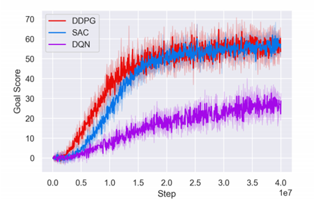

DDPG算法（深度确定性策略梯度），属于无模型中的actor-critic方法中的off-policy算法。DDPG是在DQN算法的基础之上进行改进的，DQN只能解决含有离散和低维度的动作空间的问题，而一般的物理问题或控制问题中，动作空间是连续的，因此基于连续空间提出DDPG算法。

足球场空间设置很大，在本文中设置为1000x800，而且机器人位置为连续变量，足球位置也为连续变量，如果考虑1v1足球赛，那么状态空间达到六维，在动作向量设置上，共有四个方向，虽然设定的方向为离散变量，但是从连续型向量转变为离散向量简单，所以足球机器人训练特点为维度高，值连续。

足球机器人问题由于状态空间维度高，值连续，所以更适用于DDPG算法。

## DDPG算法原理

DDPG总共含有4个网络，两类网络Actor和Critic，分别由训练网络和目标网络构成

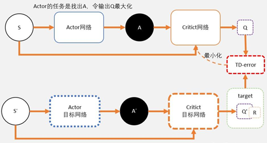

### 输入输出

- **Actor 模型的输入**：环境状态  
- **Actor 模型的输出**：具有连续值的动作  

- **Critic 模型的输入**：环境状态和动作  
- **Critic 模型的输出**：Q值，即当前状态-动作对的预期总奖励  

---

### Actor当前网络和目标网络

- **Actor当前网络**：负责策略网络参数θ的迭代更新，负责根据当前状态S选择当前动作A，用于和环境交互生成S′, R  
- **Actor目标网络**：负责根据经验回放池中采样的下一状态S′选择最优下一动作A′，网络参数θ′定期从θ复制  

---

### Critic当前网络和目标网络

- **Critic当前网络**：负责价值网络参数w的迭代更新，负责计算当前Q值Q(S,A,w)  
  - 目标Q值：$$ y_i = R + \gamma Q'(S', A', w') $$

- **Critic目标网络**：负责计算目标Q值中的 $ Q'(S', A', w') $ 部分，网络参数w′定期从w复制  

---

### 目标函数

- **Critic网络的优化目标**是最小化预测Q值和实际Q值的均方误差：
  $$
  L = \frac{1}{N} \sum_i \left( y_i - Q(s_i, a_i \mid \theta^Q) \right)^2
  $$

- **Actor网络的损失函数**是从critic网络中采样获取的Q值的平均值，更新方法是基于梯度上升：
  $$
  J(\theta) = -\frac{1}{m} \sum_{j=1}^m Q(s_i, a_i, w)
  $$

---

### TRICKS

#### Replay Buffer

DDPG使用Replay Buffer经验池存储通过探索环境采样的过程和奖励 $(S_t, a_t, R_t, S_{t+1})$。Replay Buffer在帮助代理加速学习以及DDPG的稳定性方面起着至关重要的作用。

#### 软更新

每次目标模型更新的参数幅度小，有利于模型的鲁棒性，更新参数为TAU，更新公式如下：

$$
\begin{aligned}
\theta^{Q'} &\leftarrow \tau \theta^Q + (1 - \tau) \theta^{Q'} \\
\theta^{\mu'} &\leftarrow \tau \theta^\mu + (1 - \tau) \theta^{\mu'}
\end{aligned}
$$

#### Exploration Noise

向Actor选择的动作添加噪声，使得DDPG更加鼓励探索和改进学习过程，达到exploration和exploitation的平衡。使用高斯噪声 $ N_t $ 添加到智能体的动作选择过程：

$$
a_t = \mu(s_t \mid \theta^\mu) + N_t
$$


## DDPG算法流程

### 网络及参数

- **网络组成**：
  - Actor当前网络
  - Actor目标网络
  - Critic当前网络
  - Critic目标网络

- **参数对应**：
  - Actor当前网络参数：θ  
  - Actor目标网络参数：θ′  
  - Critic当前网络参数：w  
  - Critic目标网络参数：w′  

---

### 超参数

- 回报折扣因子 γ  
- 软更新系数 τ  
- Actor网络学习率 LR_A  
- Critic网络学习率 LR_C  
- 最大迭代次数 EPOCH  
- 批数据量 BATCH_SIZE  
- 随机噪音函数 N_t  

---

### 初始化步骤

1. 随机初始化 θ, w  
2. 目标网络初始同步：
   - w′ ← w  
   - θ′ ← θ  
3. 清空经验池 Buffer  
4. 根据当前状态初始化 S，得到特征向量 s  

---

### 迭代流程（训练过程）

For i from 1 to EPOCH：

1. **Actor当前网络基于状态s得到动作a**：
   $$
   a_t = \mu(s_t \mid \theta^\mu) + N_t
   $$

2. **执行动作a，得到新状态s′，奖励r**  
   奖励r的具体方式见于4.4.1.3，分为：
   - 正确方向得分 `dicR`
   - 控球得分 `baR`
   - 进球得分 `goaR`

3. **将四元组 (s, a, r, s′) 存入经验池 Buffer 中**

4. **状态更新**：
   $$
   s \leftarrow s'
   $$

5. **从经验池 Buffer 中采样 BATCH_SIZE 个数据作为一批，计算目标 Q 值 y_i**：
   $$
   y_i = r_i + \gamma Q'\left(s_{i+1}, \mu'\left(s_{i+1} \mid \theta^{\mu'}\right) \mid \theta^{Q'}\right)
   $$

6. **通过神经网络的梯度反向传播来更新 Critic 当前网络的所有参数 w**

7. **通过神经网络的梯度反向传播来更新 Actor 当前网络的所有参数 θ**

8. **根据当前网络参数，软更新目标网络参数 θ′, w′**：
   $$
   \begin{aligned}
   \theta^{Q'} &\leftarrow \tau \theta^Q + (1 - \tau) \theta^{Q'} \\
   \theta^{\mu'} &\leftarrow \tau \theta^\mu + (1 - \tau) \theta^{\mu'}
   \end{aligned}
   $$

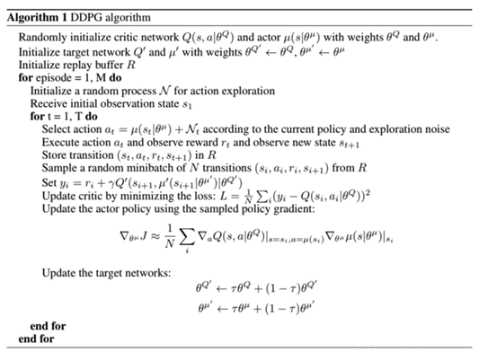

# DDPG模型训练

采用强化学习机器人与符号智能机器人对战的方式进行强化学习机器人训练，其中符号智能机器人的细节将在后文展开。


### 4.4.1 参数设置

#### 参数

1. **状态空间维度 S_DIM**  
   设置为 6，状态向量 $s = (x₁, y₁, b_x, b_y, x₂, y₂)$，分别表示：
   
   - DDGP机器人的位置坐标$ (x_1, y_2)$
   - 球的位置坐标$ (b_x, b_y)$
- 符号智能机器人的位置坐标$ (x_2, y_2)$
   
2. **动作空间维度 A_DIM**  
   设置为 4。DDPG为连续型网络，所以输出 a 为连续值。使用 `argmax` 提取模型输出结果 a 的最大值索引：
   
   ```python
   dic = np.argmax(a)
   ```

   设置全局变量方向映射：
   ```python
   direction = ["up", "down", "left", "right"]
   ```
   则 DDGP 机器人的移动方向为：`direction[dic]`

3. **奖励 r 的构成**  
   奖励分为三个部分：
   - 正确方向得分 `dicR`
   - 控球得分 `baR`
   - 进球得分 `goaR`

   加入正确方向得分 `dicR` 能更快使模型收敛，详细探讨见于 8.2 节。因为正确方向得分能够缓解其他两种得分的稀疏性问题，在每一步训练中都能给予智能体有效的奖励信息。

   | R（奖励）                  | 我方行动 | 对方行动 |
   | -------------------------- | -------- | -------- |
   | 控球一次                   | +300     | -300     |
   | 射门一次                   | +1000    | -1000    |
   | 球在上（下）方时向上（下） | +100     | Null     |
   | 球在上（下）方时向下（上） | -100     | Null     |
   | 球在左（右）方时向左（右） | +100     | Null     |
   | 球在左（右）方时向右（左） | -100     | Null     |

   > 由以上三点可知，Replay Buffer 存储的四元组 $ (S_t, a_t, R_t, S_{t+1}) $ 是一个 **17维向量**。

---

#### 超参数

超参数如下，数值通过第三问中的遗传算法得出，具体过程见后文。

| 超参数                | 数值  |
| --------------------- | ----- |
| Actor网络学习率 LR_A  | 0.001 |
| Critic网络学习率 LR_C | 0.002 |
| 回报折扣因子 γ        | 0.9   |
| 软更新系数 TAU        | 0.01  |
| 批数据量 BATCH_SIZE   | 32    |
| 经验池容量 CAPACITY   | 10000 |
| 动作范围 action bound | 4     |


### 两次训练法训练模型

由于模型训练所需时间较长，所以采用预训练+训练的两次训练法。预训练设置为50次epoch，每20次进球（双方加和）设置为1个epoch。第二次训练设置为30次epoch。

 训练开始时，因为DDPG模型的参数随机初始化，因此DDPG机器人表现不佳，运动完全随机，这样也实现了exploration的功能，尽可能多地探索场地，为经验池提供更多的信息。如下图所示，DDPG机器人并不能追踪球的方向，而只是在场地随机游走。

预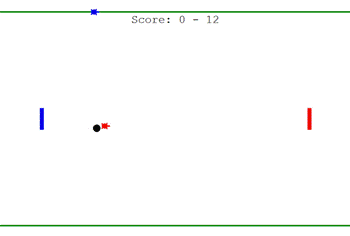
预训练到23次epoch时，模型表现力迅速上升。

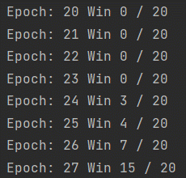

预训练结果如下所示：

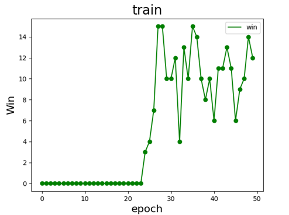

但是模型表现力不稳定，存在震荡情形。

预训练完成后，DDPG机器人的进球率大幅上升，在训练阶段初始，与符号智能机器人实力相当。

最后，载入预训练结果又训练了30个epoch，部分epoch结果如下：

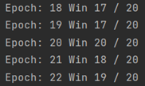

模型结果展示为：

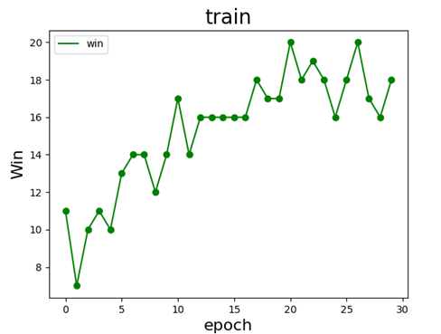

DDPG机器人模型最后每20次比赛都可以进绝大多数的球，DDPG模型训练成功。

# 基于符号智能的机器人模型

## 知识表示

知识表示是指将现实世界中的事物和关系用符号语言进行描述和表达，以便计算机能够理解和处理。

常见的知识表示方法有谓词逻辑、产生式规则、框架等。谓词逻辑使用一组符号来描述事物和关系，包括命题符号、连接符号和量化符号。其中，命题符号用来表示具体的事物或概念，连接符号用来表示事物之间的关系，量化符号用来表示时间和数量；产生式规则则类似于IF语句分为条件与结论部分，当条件部分成立时，结论部分的操作自动执行；框架将具有相似特性的事物归为同一个类别，并在类别中定义一些属性和操作，以便于对实例进行描述和处理。

对机器人进行训练，先要提取足球比赛中的规则，为了化简模型与更好的效果考虑，我们简化需要考虑的规则如下：

（1）活动范围不能在划定足球场地范围之外；

（2）将球踢进对方的球门即判定为胜；

（3）不能使用碰撞对方的方式通过犯规获胜

对（1），我们有对于足球场地范围的两个取值范围，因此在规定步长的情况下如果出现机器人出场的情况我们将机器人向相反方向拉回原步长即可；

对（2），若我们想要将球踢进对方的球门则一定要与球接触，因此将此过程分为两个过程：与球未接触的过程和与球接触的过程。当运动员与球未产生接触时，他需要尽可能缩短自己与球的距离；当运动员与球产生接触时，他需要尽可能使球向对方的球门移动。

对于上述所说的第一个过程，这意味着运动员需要在信息引导下向球的方向移动，同时需要添加一定的随机因素以保证不会陷于某些特殊情况导致结果不佳（如不断向球移动导致球被踢进己方球门）；对于第二个过程即踢球的过程分为踢球角度和踢球距离，二者在第二部分智能体模型中已有论述，综合考虑了惯性和运动员的控球等因素；

对（3），只需不考虑运动员自身的碰撞体积即可。因此我们可将上述先验知识库作如下规则表示：

对（3），只需不考虑运动员自身的碰撞体积即可。因此我们可将上述先验知识库作如下规则表示：

| 条件            | 结论                      |
| --------------- | ------------------------- |
| over(x, border) | gd(x_step - direction(x)) |
| touch(x, ball)  | kick(θ, s)                |
| ¬touch(x, ball) | go(x_step, direction(x))  |

其中：
- over(x, y): x 向量超过 y 范围
- go(x, y): 向 y 方向移动 x 距离
- touch(x, y): x 与 y 距离小于某提前给定的阈值
- kick(x, y): 使自己接触到的实体向角度 x 移动 y 的距离

## 基于上述推理的算法流程

```
over(x, border)

IF PLAYER.X > BORDER.X_MAX  // PLAYER 为智能体对象，PLAYER.X 即对象的 X 坐标，Y 同理
THEN PLAYER.X := PLAYER.X--PLAYER_STEP  // PLAYER_STEP 为设定步长

IF PLAYER.Y > BORDER.Y_MAX
THEN PLAYER.Y := PLAYER.Y--PLAYER_STEP

IF PLAYER.X < BORDER.X_MIN
THEN PLAYER.X := PLAYER.X++PLAYER_STEP

IF PLAYER.Y < BORDER.Y_MIN
THEN PLAYER.Y := PLAYER.Y++PLAYER_STEP
```


```
touch(x, ball)

IF DISTANCE(PLAYER, BALL) < THRE
THEN KICK(GET_THETA(PLAYER), GET_S(T))  

// 角度值 THETA 由运动员所处的位置及球的位置确定，而路程 S 则是正态分布的随机变量，可以使用 T 来确定
```


    touch(x, ball)
    
    IF RANDOM
        IF PLAYER.X > BALL.X  # BALL 即为足球，BALL.X 为足球位置的 X 坐标
            PLAYER.X := PLAYER.X - PLAYER.STEP
    
        IF PLAYER.Y > BALL.Y:
            PLAYER.Y := PLAYER.Y - PLAYER.STEP
    
        IF PLAYER.X < BALL.X:
            PLAYER.X := PLAYER.X + PLAYER.STEP
    
        IF PLAYER.Y < BALL.Y:
            PLAYER.Y := PLAYER.Y + PLAYER.STEP


# 基于遗传算法的超参数优化

## 比较情况

根据4.4模型训练部分可知：通过对于深度强化学习控控制方法和符号智能控制方法的智能体的比赛情况，在前期由于符号智能拥有先验知识库，其发挥较为稳定，也能更出色地完成比赛任务，而深度强化学习控制的智能体更偏向于“学习”的经验积累过程而非应用，因此在前期，符号智能控制方法的智能体拥有更为出色的表现。

但随着学习过程的进行与比赛的深入，在经过80个epoch训练后，拥有深度强化学习控制方法的模型已能够在不同的环境状态下根据足球、自己及对手的位置选择较为合理的移动策略，相比于符号智能具有更为优良的表现。

因此在此选取基于深度强化学习控制方法的智能体，通过遗传算法进行优化。

## 优化目标

我们通过遗传算法对DDPG学习网络中的超参数进行优化。对于在某个状态下智能体我们可以根据其下一步动作、状态转移及奖励函数算出其回报的期望。我们的优化目标即

$$\min_{w,b \in \Omega} f(w) = \sum_{i=1}^{n} \left| d_i - o_i(w) \right|$$

其中 $ w $ 为神经网络的超参数。$ \Omega $ 为 $ w $ 的取值空间，$ d_i $ 表示样本的第 $ i $ 个输出即实际算出的 Q 值，$ o_i(w) $ 为我们通过神经网络预测的结果。将上式中的绝对值计算转为求其方差和的运算并通过对于参数的调整以使得上述结果最小，预测结果尽可能准确，达到优化目的。

## 遗传算法

遗传算法是借鉴达尔文自然选择下进化论的模型，将解抽象成一个个的个体，通过个体的交叉、变异及环境的自然选择不断迭代，将更符合条件的个体筛选出来，获得局部最优或全局最优解的过程。遗传算法具有较强的自适应性与优良的全局搜索性能。其流程图为：

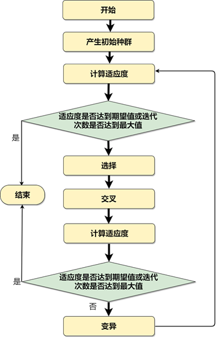

遗传算法的一般步骤为：首先对数据以二进制或浮点数等方式编码，随机生成一批初始个体，这些个体被作为初始的解。然后定义评估函数，对于每一个个体，我们通过评估函数计算其适应度，对于适应度较低的个体我们将其淘汰而将适应度较高的个体加入下一轮的繁殖过程中，通过交叉算子和变异算子实现产生下一代的过程。在子代生成后同样利用评估函数计算其适应度，以较高的概率选取适应度高的个体获取较为优质的子代，重复迭代，直到子代适应度满足解的要求或达到指定迭代次数或两代之间的差异性不再明显为止。

## 对超参数进行遗传算法优化的步骤

对 actor 网络的学习率 `LR_A`、critic 网络的学习率 `LR_C`、折扣因子、batchsize、TAU 等五个超参数进行优化，按照上述遗传算法步骤如下：

### 编码方式

直接采用浮点数编码，将五个超参数作为一个五维向量，将其作为个体进行计算。

### 初始化解

在值域可行的范围内随机生成 `N` 个个体，然后定义适应度函数。将每个超参回代神经网络中进行 BP 学习，将训练 `M` 个 epoch 后 Actor 网络的 loss 值的相反数，作为个体的适应度函数，因为 loss 值越小，网络性能越好：

$$
\text{fitness} = -\text{loss}_a
$$

### 交叉算子

对于交叉算子，我们采用两点交叉和三点交叉，在每次需要进行交叉计算时采用并行的计算方式，最后根据适应度择优选取。

- **两点交叉**：随机选择 5 个位点中的一个，交换位点前的所有基因节点；
- **三点交叉**：随机生成两个位点索引，交换中间的所有基因位点。

每轮选择个体进行交叉计算生成 `S` 个新个体，不同的交叉方式更有利于算法跳出局部最优解，扩大解的范围。

### 变异算子

变异算子的计算我们假定一个概率 `p`，采用随机数的方法，当 0 与 1 之间的随机数大于 `p` 后才发生变异。变异采用如下的公式：

$$
a_{\text{new}} = a + (r_1 \cdot (1 - \frac{G}{G_{\text{max}}})^{b}) \cdot (r_2 \cdot (UB - LB) + LB)
$$

其中：
- `a` 代表基因，
- `r1`、`r2` 为随机数，
- `G` 为当前迭代次数，
- `G_max` 为最大迭代次数。

采用上述公式更新既可以控制变异使值增大和缩小的概率相等，又可以同时实现在前期以高变异率扩大解范围避免陷入局部最优，和在后期以低变异率缩小解范围促进收敛速度。

### 自然选择方式

在自然选择方式上，我们采用轮盘赌的方法，即假设某个体的适应度为 $ f_i $，则其存活的概率为：

$$
P_i = \frac{f_i}{\sum_{i=1}^{n} f_i}
$$

在轮盘赌的方法下，适应度越高的个体能够将优良基因传递给下一代个体的概率越大，但同时适应度低的个体也不一定必然被淘汰。这既符合自然规律，也在一定程度上避免了陷入局部最优解的可能。

在进行自然选择后，我们将所有个体合并，进行下一轮的交叉、突变和选择，直到总误差能够低于我们所设定的阈值 `e` 或总轮数大于我们所设定的阈值 `t_max`。

## 结果

使用了GA算法对神经网络的超参数进行了优化，载入预训练模型，初始化50个个体，将训练10个epoch后Actor网络的loss值的相反数，作为个体的适应度函数，将最优适应度，作为种群的适应度，运行50代结果为：

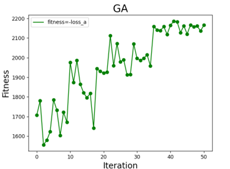

遗传算法具有很大的随机性最初种群最优适应度表现为大幅震荡，但是在经过多代的迭代后达到了收敛，输出种群最优适应度个体，得到最优参数，最终确定了DDPG算法的超参数如下：

| 超参数               | 数值  |
| -------------------- | ----- |
| Actor网络学习率LR_A  | 0.001 |
| Critic网络学习率LR_C | 0.002 |
| 回报折扣γ            | 0.923 |
| 软目标参数TAU        | 0.011 |
| 批数据量BATCH_SIZE   | 32    |

# 基于群智能实现3v3足球比赛

## 协调与合作

对于多机器人之间的协调与合作水平可以从协作层、知识层、协调层、组织层来考虑。第一层即协作层，若多个机器人在一起完成同一目标或类似目标，或在一起进行时具有某种效率的提高，我们称之为具有协作性。在知识层，协作被分为有意识的和无意识的。有意识即能够得到队友状态、动作或是其它方面的信息从而更好合作决策，无意识则在执行任务时不考虑队友的行为。对协调层来说，其强弱主要由智能体之间的信息交互来决定；最后的组织层则要看个体的组织方式，是否有特定实体发布指挥信息等。

## PSO算法

粒子群算法是一种受到鸟或鱼等生物的启发而发明的一种群智能算法，每个个体都会根据自身和群体的经验来调整自己的下一步行动以使得到的利益最大化。在PSO算法中，粒子的两个属性为速度与位置，恰对应了强化学习中的动作与状态，有利于对3v3足球模拟的实现，同时PSO算法利用了群体的信息，实现了协作中知识方面的有意识合作行为。

PSO算法的基本步骤为：初始化随机生成一群粒子，而每个粒子都对应着问题空间的一组解，通过评估函数来评判解的优越性。在每次迭代中，每个粒子要根据之前的速度、自己历史的最优位置、群体历史的最优位置来更新参数从而确定下一步的行动，在每次行动后再次套用评估函数并更新自己最优位置pBest和群体最优位置gBest，最终在达到终止条件时停止。其更新公式一般为：

$$
\begin{align*}
v_{ij}(t+1) &= v_{ij}(t) + c1 * r1(t)[p_{ij}(t) - x_{ij}(t)] + c2 * r2(t)[g_{ij}(t) - x_{ij}(t)] \\
x_{ij}(t+1) &= x_{ij}(t) + v_{ij}(t+1)
\end{align*}
$$

其中$c1$、$c2$为学习因子，影响$pBest$和$gBest$对每次决策的影响程度，而$r$函数则代表了随机因素，尽可能避免陷于局部最优解。还可在原始速度上乘以惯性因子以控制原有位置信息对于接下来的行动的影响程度。在上式中，$pBest$为自我认知部分，表示自己的经验；而$gBest$则为社会部分，表示社会积累的知识、所有粒子的合作结果。先前速度起扩大解空间的exploration作用，而两个最佳位置则充分利用历史信息，起缩小解空间的exploitation作用。

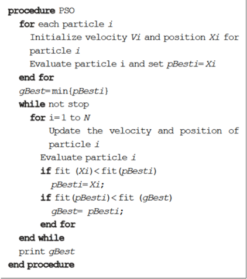

## 算法设计

将每一个足球运动员作为粒子群中的一枚粒子，初始化其位置与速度。评估函数的设计考虑两个方面：一方面，考虑状态下一队队员与球的距离。对与球距离和更近的评估函数的取值更高，更有机会取得球的控制权；另一方面，考虑球与球门的距离。若能够使得球与对方球门的距离减少则评估函数应该高，若球离己方球门更近则评估函数的取值应该酌情降低。以此来设计评估函数并以进球作为最高的目标。初始化后进行迭代，每次迭代根据PSO算法步骤更新两队的pBset和gBest，以不断提高评估函数的值为目的，从而使智能体在每一次进行方向的决策时能偏向于较优策略。


## 结果

在群智能方面使用PSO算法实现3人制足球比赛的控制方法以达到三人间配合赢得比赛的目的。实际在比赛的过程中，在大多情况下3人的行为较为准确，但在某些情况会出现不奔向球却直接跑过球的现象，推测可能是由于在速度的影响因素中惯性对结果的影响比重过大导致，可以尝试加入惯性系数以降低惯性的影响，或将惯性对速度的影响与迭代次数偶联，使得在前期惯性的影响较大，而在后期逐渐降低惯性对速度的影响。

3v3比赛过程图：

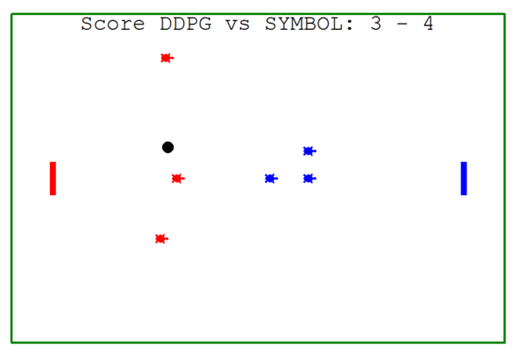

# 实验与结果分析

## 足球机器人控制方法对比分析

实验中用到了基于深度强化学习和基于符号智能的两种控制方法。

对于第一种控制方法来说，进行训练的过程是一个学习与输入的过程，通过与对手的比赛中获得的奖励不断调整参数与自身行为，从开始的完全随机到之后逐渐开始进行正确的决策；而符号智能则在一开始就输入知识库与产生式规则，将规则即时用在比赛的策略中。    
在比赛初期，符号智能的表现更为优异，因为此时强化学习智能体的参数尚且处于混沌状态，强化学习的智能体更偏向于在摸索中收集信息、学习信息以调整参数，而符号智能则能够很快地将先前输入的知识用于实践，因而表现出较强的目的性与较清晰的行动。而随着训练次数的不断增多，强化学习所学习到的信息逐渐能够通过神经网络构建起来，强化学习智能体开始反超符号智能，表现出更优的智能和更强的行动能力。1v1比赛过程：

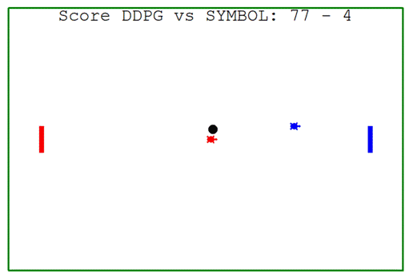

DDPG训练的模型表现：


在上图中DDPG的表现出现了震荡波动的现象。分析由于起始球的位置为在一定范围内随机生成，推测可能与这一随机因素有关，可尝试将球每次生成都固定在中心点，或许会获得更为稳定的结果。

## DDPG算法的回报函数优化

在本文的DDPG算法训练过程中，一开始采用奖励r函数，为两部分组成，正确方向得分`dicR`，和控球得分`baR`，模型收敛速度较慢。加入了正确方向得分`dicR`后模型收敛速度加快。

**设计实验：**

- 设置40次epoch
- 完全初始化参数进行训练
- 每20次进球（双方加和）设置为1个epoch
- 对比加入正确方向得分`dicR`与否对DDPG模型训练的影响

**实验结果表明：**
- 加入正确方向得分`dicR`能更快使模型收敛。

**分析原因：**

- 正确方向得分能够减少其他两种得分的稀疏性，在机器人训练的每一步都能给予奖励r的信息，从而让机器人更快地学习。

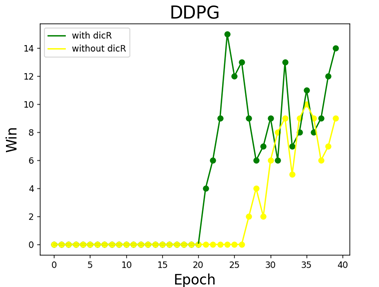

## 基于GA算法的强化学习超参数优化

在本次实验中，我们使用了GA算法对神经网络的超参数进行了优化，载入预训练模型，初始化50个个体，将训练10个epoch后Actor网络的loss值的相反数，作为个体的适应度函数，将最优适应度，作为种群的适应度，所使用的GA算法超参数如下：

| 超参数    | 数值 |
| --------- | ---- |
| 初始个体N | 100  |
| 世代M     | 50   |
| 子代个体S | 100  |
| 变异概率P | 0.4  |

运行50代结果为：

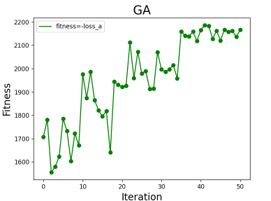

遗传算法具有很大的随机性最初种群最优适应度表现为大幅震荡，但是在经过多代的迭代后达到了收敛，输出种群最优适应度个体，得到最优参数，最终确定了DDPG算法的最优超参数如下：

| 超参数               | 数值  |
| -------------------- | ----- |
| Actor网络学习率LR_A  | 0.001 |
| Critic网络学习率LR_C | 0.002 |
| 回报折扣γ            | 0.923 |
| 软目标参数TAU        | 0.011 |
| 批数据量BATCH_SIZE   | 32    |

可以看到，最初GA的结果震荡的较为明显，这可能是由于在变异算子中与迭代次数相关的系数取值较大，变异的波动较为剧烈，同时由于种群还未经过很多的筛选基因杂质较多，在交叉中难以确定新生成解的质量，由轮盘赌算法得以保存下来。而随着自然选择的不断进行和变异算子中相关系数的减小，变异所起的作用逐步缩减，解空间也在缩小，整体趋于收敛到全局最优解。

尽管整体图像随着迭代结果趋于向好，但其仍然有波动幅度较大的现象。猜测可能是由于变异概率P设置过大导致，可以尝试将P的值适度所小，或仿照变异算子内部的算法将P设定为一个初始值乘以一个与迭代次数相关的系数，在迭代未开始时其变异概率较大，但随着迭代的不断进行变异的概率逐步下降，最终收敛到一个较为优质的解范围。

## 基于群智能算法的3v3足球赛策略对比

对DDPG队采用PSO群智能算法进行控制，而符号智能队则为完全相同的三个机器人。

分别设置超参数学习因子，分为 $ c_1=2, c_2=2 $ 以及 $ c_1=1, c_2=1 $ 两种情况，进行比较。

- **情况一**：集中型策略，$ c_1=2, c_2=2 $
- 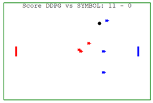
- **情况二**：分散型策略，$ c_1=1, c_2=1 $
- 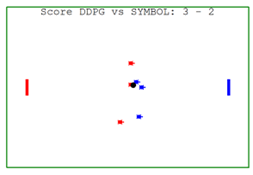

其中左边红色为DDPG队，右边蓝色为符号智能队。

现在让DDPG队和符号智能队比赛50轮episode，每个episode由100次进球（不论双方）组成，现在比较两种策略下DDPG队的进球次数。

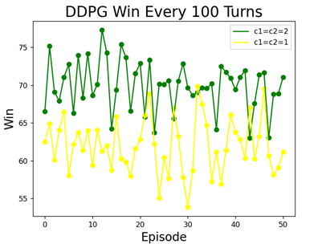

结果分析：在情况一集中型策略下，学习因子较大，这时所有个体趋向于群体最优，向群体最优收敛的更快，所以个体趋向于集中向球所在的方向。在情况二分散型策略下，学习因子较小，这时个体向群体最优收敛的更慢，而这时，由于强化学习在初期训练时主要集中在中路进行训练，当机器人处于上路和下路时，经验就显得不足，所以，由于上路和下路没有得到充分训练，采用集中型策略，上路和下路机器人就可以获得更多的信息，从而采取更优的决策。

综上，经过分析，之所以高学习因子的集中型策略更优，主要是因为DDPG模型的训练主要在中路进行，上路和下路的经验较少，训练不足，而高学习因子下，粒子之间的信息共享更多，填补了上路和下路机器人经验的不足。所以，后续还会增多DDPG模型在上路和下路的训练，在此基础上继续研究学习因子的影响。

# 结论

在对基于深度强化学习的智能体和基于符号智能的智能体的比较中：符号智能以其先验知识的优势在前期取得了良好的表现成绩；而强化学习则在与符号智能的智能体比赛的过程中进行学习，在后期得到了显著的提升与良好的模型表现。

在DDPG训练中，加入正确方向得分`dicR`能更快使模型收敛。通过GA对超参数的优化，Q神经网络具有更快的收敛速度和更小的均方误差。

最后在3v3的足球比赛中使用群智能，基于能较好实现有意识协调合作的PSO算法采用了两种策略，其中集中型策略以更多的团队信息共享取得了较大的优势。
